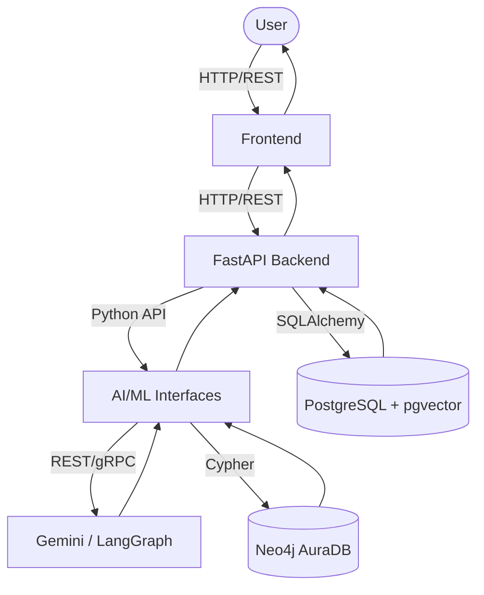
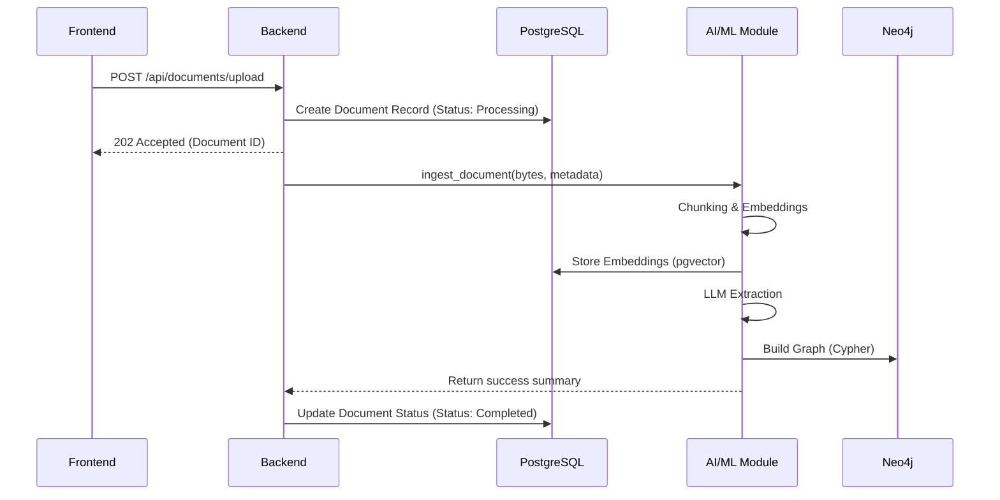

# Integration Contract - Bedrock

## 1. Purpose
This document serves as the single source of truth for how every module in the **Bedrock** platform communicates. It is not an architecture overview, but rather a strict integration contract. It defines API boundaries, function interfaces, data ownership, request/response schemas, integration flows, and strict rules for interaction. By adhering to this contract, all developers across Frontend, Backend, AI/ML, and Infrastructure can work independently and integrate seamlessly with minimal conflicts.

Every module must communicate **only** through the interfaces defined in this document.

---

## 2. High-Level Integration Flow

The following diagram illustrates the end-to-end integration flow of the system.



---

## 3. Module Responsibilities

| Module | Owner | Responsibilities | Exposed Interfaces |
| :--- | :--- | :--- | :--- |
| **Frontend** | Frontend Lead | Render UI, manage client state, handle user input, display knowledge graph. | None (Consumes Backend API) |
| **Backend** | Backend Lead | Serve REST APIs, manage relational data (PostgreSQL), orchestrate AI jobs, handle auth & routing. | REST API endpoints |
| **AI/ML** | AI/ML Lead | Extract entities/relationships, generate embeddings, build graph, perform hybrid retrieval. | Python interface functions |
| **Infrastructure** | DevOps | Manage Docker orchestration, environment vars, CI/CD, and deployments. | Port 8000, 5173, 5432 |

---

## 4. Backend ↔ AI/ML Contract

The AI/ML module is imported into the FastAPI backend as a standard Python package. The backend must strictly call the functions exposed in `ai_ml/interfaces/`.

### `ingest_document(file_content: bytes, metadata: dict) -> dict`
- **Inputs**: Raw file bytes and associated metadata (e.g., filename, author).
- **Outputs**: `{ "status": "success", "document_id": "uuid", "entities_extracted": int }`
- **Errors**: `ValueError` (invalid format), `RuntimeError` (LLM failure).
- **Expected Behavior**: Parses text, extracts entities, generates embeddings, updates Neo4j, and returns summary stats.

### `query_knowledge(query_text: str, filters: dict) -> dict`
- **Inputs**: Natural language query string and optional filter dictionaries.
- **Outputs**: `{ "answer": "text", "sources": [...], "confidence": float }`
- **Errors**: `ValueError` (empty query), `TimeoutError`.
- **Expected Behavior**: Performs hybrid search (pgvector + Neo4j) and synthesizes a final answer using the LLM.

### `get_graph_neighborhood(entity_id: str, depth: int = 1) -> dict`
- **Inputs**: The unique ID of an entity and traversal depth.
- **Outputs**: `{ "nodes": [...], "edges": [...] }` (Matches `GraphNode` and `GraphEdge` schemas).
- **Errors**: `KeyError` (entity not found).
- **Expected Behavior**: Queries Neo4j for the immediate sub-graph surrounding the entity.

### `run_failure_scan(equipment_id: str) -> dict`
- **Inputs**: ID of the equipment to analyze.
- **Outputs**: `{ "risk_level": "high|medium|low", "potential_failures": [...], "recommendations": [...] }`
- **Errors**: `KeyError`, `RuntimeError`.
- **Expected Behavior**: Agentic workflow that cross-references past incidents and manuals to predict failure risks.

---

## 5. Backend ↔ Database Contract

Database access is strictly segregated to prevent race conditions and maintain clear data ownership.

**PostgreSQL (Owned & Accessed by Backend):**
- Document metadata (file names, upload dates, status).
- Embeddings (pgvector).
- Alerts & Notifications.
- Audit logs & User data.
- Ingestion job statuses.

**Neo4j (Owned & Accessed by AI/ML):**
- Extracted Entities (Equipment, Parts, Incidents).
- Relationships (`PART_OF`, `CAUSED_BY`, `RESOLVED_BY`).
- Graph traversal states.

*Rule:* The Backend must never write Cypher queries directly. The AI/ML module must never write SQLAlchemy queries directly.

---

## 6. Frontend ↔ Backend REST API

The Backend exposes a strict RESTful API consumed by the Frontend.

### POST `/api/documents/upload`
- **Purpose**: Upload a new document for processing.
- **Request Body**: `multipart/form-data` (file).
- **Response Body**:
  ```json
  {
    "id": "doc-123",
    "status": "processing",
    "message": "Upload successful, ingestion started."
  }
  ```
- **Status Codes**: 202 Accepted, 400 Bad Request.

### POST `/api/query`
- **Purpose**: Submit a natural language query against the knowledge base.
- **Request Body**:
  ```json
  {
    "query": "What causes the main valve to leak?",
    "filters": { "date_range": "last_year" }
  }
  ```
- **Response Body**:
  ```json
  {
    "answer": "The main valve typically leaks due to...",
    "sources": [{"doc_id": "doc-123", "title": "Maintenance Manual"}],
    "confidence": 0.89
  }
  ```
- **Status Codes**: 200 OK, 422 Unprocessable Entity.

### GET `/api/documents`
- **Purpose**: List all uploaded documents.
- **Response Body**: Array of `Document` objects.
- **Status Codes**: 200 OK.

### GET `/api/documents/{id}`
- **Purpose**: Get metadata and status for a specific document.
- **Response Body**: `Document` object.
- **Status Codes**: 200 OK, 404 Not Found.

### GET `/api/graph/neighborhood?entity_id={id}&depth=1`
- **Purpose**: Fetch graph data for visual rendering.
- **Response Body**:
  ```json
  {
    "nodes": [...],
    "edges": [...]
  }
  ```
- **Status Codes**: 200 OK, 404 Not Found.

### GET `/api/alerts`
- **Purpose**: Fetch system and failure alerts.
- **Response Body**: Array of `Alert` objects.
- **Status Codes**: 200 OK.

### POST `/api/alerts/{id}/acknowledge`
- **Purpose**: Mark an alert as acknowledged.
- **Request Body**: Empty.
- **Response Body**: `{ "status": "acknowledged" }`
- **Status Codes**: 200 OK, 404 Not Found.

---

## 7. Standard Data Models

These JSON schemas represent the unified data models shared across Frontend and Backend.

**Document**
```json
{
  "id": "uuid",
  "filename": "manual_v1.pdf",
  "upload_date": "2026-07-14T10:00:00Z",
  "status": "completed"
}
```

**Alert**
```json
{
  "id": "alert-456",
  "severity": "high",
  "message": "Potential failure detected in Pump A",
  "created_at": "2026-07-14T11:30:00Z",
  "acknowledged": false
}
```

**GraphNode**
```json
{
  "id": "node-789",
  "label": "Equipment",
  "properties": {
    "name": "Centrifugal Pump",
    "model": "CP-2000"
  }
}
```

**GraphEdge**
```json
{
  "id": "edge-123",
  "source": "node-789",
  "target": "node-999",
  "type": "HAS_PART"
}
```

---

## 8. AI Output Contract

Regardless of the underlying LLM or LangGraph complexity, the AI module must always yield JSON in this exact structure when performing extraction tasks.

```json
{
  "entities": [
    {
      "id": "ent-1",
      "type": "Equipment",
      "name": "Heat Exchanger",
      "properties": {"status": "operational"}
    }
  ],
  "relationships": [
    {
      "source_id": "ent-1",
      "target_id": "ent-2",
      "relation_type": "CONNECTED_TO"
    }
  ],
  "summary": "Document details the operational status of the heat exchanger.",
  "confidence": 0.95,
  "errors": []
}
```

---

## 9. Error Contract

All API errors must follow this standard JSON format to allow the Frontend to handle them predictably.

```json
{
  "error": {
    "code": "INVALID_INPUT",
    "message": "The provided query string was empty.",
    "details": {}
  }
}
```

**Standard Status Codes:**
- `400 Bad Request` / `422 Unprocessable Entity`: Invalid Input.
- `401 Unauthorized`: Missing or invalid authentication.
- `404 Not Found`: Resource does not exist.
- `409 Conflict`: Duplicate entity or state conflict.
- `429 Too Many Requests`: Rate Limit exceeded.
- `500 Internal Server Error`: Unhandled backend or AI failure.

---

## 10. Event Flow

### Document Upload Sequence


---

## 11. Environment Variable Ownership

| Variable | Purpose | Used By | Required |
| :--- | :--- | :--- | :--- |
| `DATABASE_URL` | Local Postgres connection string | Backend | Yes |
| `SUPABASE_URL` | Hosted DB API endpoint | Backend (Prod) | No (Prod only) |
| `SUPABASE_KEY` | Hosted DB auth key | Backend (Prod) | No (Prod only) |
| `NEO4J_URI` | AuraDB connection URI | AI/ML | Yes |
| `NEO4J_USERNAME` | AuraDB username | AI/ML | Yes |
| `NEO4J_PASSWORD` | AuraDB password | AI/ML | Yes |
| `GEMINI_API_KEY` | Authentication for Gemini models | AI/ML | Yes |
| `GROQ_API_KEY` | Authentication for fast inference | AI/ML | Yes |
| `VITE_API_BASE_URL` | Points Frontend to Backend REST API | Frontend | Yes |

---

## 12. Integration Rules

1. **Frontend never accesses databases directly**: All data fetches must route through the Backend REST API.
2. **Backend is the only REST entry point**: External clients and the Frontend only talk to the FastAPI service.
3. **AI/ML is imported as Python modules, not HTTP microservices**: The Backend imports `ai_ml.interfaces` locally to eliminate internal network latency.
4. **Neo4j is accessed only through the AI/ML layer**: The Backend does not execute Cypher queries.
5. **PostgreSQL is accessed through the backend service layer**: The AI/ML layer does not write raw SQL (except strictly managed pgvector upserts orchestrated by the Backend/AI contract).
6. **Secrets are stored only in `.env`**: No hardcoded credentials in the codebase.

---

## 13. Development Workflow

To ensure smooth integration, development must follow this strict sequence:

1. **Infrastructure**: Setup Docker, databases, and environment variables (Complete).
2. **Backend Skeleton**: Scaffold FastAPI structure (Complete).
3. **Frontend Mocking**: Frontend develops UI against hardcoded JSON or mock servers matching the API Contract (Section 6).
4. **AI/ML Implementation**: AI team implements LangGraph/Neo4j logic and exposes Python functions (Section 4).
5. **Backend Wiring**: Backend implements actual endpoints, replacing mocks with calls to the DB and AI/ML layer.
6. **End-to-End Integration**: Frontend switches `VITE_API_BASE_URL` to point to the live local backend.
7. **Deployment**: CI/CD pipelines push code to Railway/Vercel.

---

## 14. Final Checklist

Every developer must verify this checklist before merging a Pull Request:

- [ ] Does my change adhere to the data ownership boundaries?
- [ ] Have I updated this Integration Contract if my PR introduces a new API endpoint?
- [ ] Do my API responses perfectly match the Standard Data Models in Section 7?
- [ ] Do my errors map correctly to the standard formats in Section 9?
- [ ] Have I ensured no direct database connections exist outside their permitted layers?
- [ ] Are all new environment variables documented in Section 11 and added to `.env.example`?
