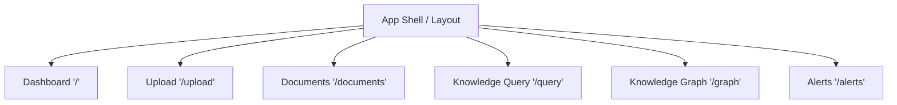

# Bedrock Frontend Functional Specification

## 1. Purpose
The **Bedrock Frontend Application** is the user-facing interface for the Industrial Knowledge Intelligence Platform. It provides a seamless, responsive, and intuitive experience for industrial operators, engineers, and safety managers to query knowledge, visualize equipment relationships, upload operational documents, and monitor AI-generated predictive failure alerts.

**Design Philosophy:**
- **"Any Device" Accessibility:** Fully responsive design supporting mobile phones, tablets, and desktop workstations seamlessly (PWA-capable).
- **Industrial Modern Aesthetic:** A premium, dark-first UI that feels reliable, precise, and state-of-the-art.
- **Explainability:** AI-generated answers and alerts must always cite their sources clearly to build user trust.
- **Real-Time Illusion:** Uses aggressive React Query polling for live status updates without the overhead of WebSockets.

---

## 2. Information Architecture
The application follows a flat, dashboard-style navigation hierarchy accessible via a persistent sidebar on desktop and a bottom/hamburger nav on mobile.

---

## 3. Global Layout
- **Sidebar (Desktop):** Collapsible left-hand navigation menu containing links to all core pages. Includes active state highlighting.
- **Top Navigation (Mobile):** Hamburger menu for small screens.
- **Header:** Sticky top header showing page title, current user status (if auth enabled), and a global search/quick-action bar.
- **Theme:** Dark mode by default using Tailwind CSS `dark:` variants.
- **Notification System:** Toast notifications for success/error states (e.g., "Upload Complete", "Alert Acknowledged").
- **Loading Indicators:** Top progress bar (like NProgress) for route transitions and skeleton loaders for initial page data fetches.

---

## 4. Page Specifications

### 4.1. Dashboard (`/`)
- **Purpose:** Provide a high-level overview of system health, recent AI alerts, and latest document ingestions.
- **UI Layout:** Grid layout with summary KPI cards at the top, followed by a split view: recent alerts (left) and recent uploads (right).
- **Components:** `MetricCard`, `AlertCard`, `DocumentTable` (mini version), `LoadingSkeleton`.
- **Backend APIs consumed:** `GET /api/alerts`, `GET /api/documents`.
- **User actions:** Click an alert to view details, navigate to full alerts/documents pages.
- **State management:** React Query with 30s polling.
- **Loading state:** Skeleton blocks for cards and lists.
- **Empty state:** "No active alerts" / "No documents uploaded yet".

### 4.2. Upload (`/upload`)
- **Purpose:** Interface for uploading heterogeneous industrial documents (PDFs, P&IDs).
- **UI Layout:** Centered, large drag-and-drop zone.
- **Components:** `UploadDropzone`, `ToastNotification`.
- **Backend APIs consumed:** `POST /api/documents/upload`.
- **User actions:** Drag file, click to browse, submit.
- **State management:** Local component state for file selection and upload progress.
- **Loading state:** Spinner with "Uploading..." text and disabled dropzone.
- **Error/Success state:** Toast notification on completion; redirect to `/documents` on success.

### 4.3. Documents (`/documents`)
- **Purpose:** Track the ingestion status of uploaded documents.
- **UI Layout:** Full-width data table.
- **Components:** `DocumentTable`, `StatusBadge`.
- **Backend APIs consumed:** `GET /api/documents`.
- **User actions:** Sort by date, filter by status.
- **State management:** React Query with 10s polling (to watch `pending` -> `ingested`).
- **Loading state:** Table row skeletons.
- **Status rules:** `pending` (yellow), `processing` (blue), `ingested` (green), `failed` (red).

### 4.4. Knowledge Query (`/query`)
- **Purpose:** Core RAG interface for asking natural language questions about industrial assets.
- **UI Layout:** Chat-like interface: persistent sticky search bar at the bottom, scrolling conversation/results above.
- **Components:** `QueryBox`, `AnswerCard`, `CitationCard`.
- **Backend APIs consumed:** `POST /api/query`.
- **User actions:** Type query, submit, click citation links to view source documents.
- **State management:** Local state for input; React Query mutation for search.
- **Loading state:** Shimmering skeleton representing AI "thinking".
- **Empty state:** "Ask a question about your equipment, manuals, or safety procedures."

### 4.5. Knowledge Graph (`/graph`)
- **Purpose:** Interactive exploration of relationships between equipment, documents, and incidents.
- **UI Layout:** Full-screen canvas with an overlay search/filter box and a collapsible side-panel for node details.
- **Components:** `GraphExplorer` (wrapping `react-force-graph`), `SearchBar`, `NodeDetailsPanel`.
- **Backend APIs consumed:** `GET /api/graph/neighborhood?tag={id}&depth={n}`.
- **User actions:** Search for equipment tag, click node to expand neighborhood, drag to pan.
- **Loading state:** Centered spinner overlay on canvas.
- **Error state:** "Entity not found."

### 4.6. Alerts (`/alerts`)
- **Purpose:** Review and acknowledge predictive failure intelligence alerts.
- **UI Layout:** List or masonry grid of alert cards sorted by severity and date.
- **Components:** `AlertCard`, `ConfirmDialog`, `SeverityBadge`.
- **Backend APIs consumed:** `GET /api/alerts`, `POST /api/alerts/{id}/acknowledge`.
- **User actions:** Click "Acknowledge" to dismiss an alert.
- **State management:** React Query with 10s polling. Mutation to acknowledge, followed by cache invalidation.

---

## 5. Component Library

- **`Navbar` / `Sidebar`:** Application shell navigation wrappers.
- **`UploadDropzone`:** Accepts drag-and-drop files, handles validation (size, type). Props: `onFileSelected`, `isUploading`.
- **`DocumentTable`:** Renders list of documents. Props: `documents`, `isLoading`.
- **`StatusBadge`:** Pill-shaped badge for statuses. Props: `status` ('pending' | 'processing' | 'ingested' | 'failed').
- **`SeverityBadge`:** Colored indicator for alert severity. Props: `level` ('high' | 'medium' | 'low').
- **`SearchBar` / `QueryBox`:** Text input with submit button and keyboard support (Enter to submit). Props: `onSubmit`, `isLoading`.
- **`AnswerCard`:** Displays Markdown-rendered AI responses. Props: `text`.
- **`CitationCard`:** Small clickable card displaying source document metadata. Props: `filename`, `relevance`.
- **`GraphExplorer`:** Wrapper around `react-force-graph`. Props: `nodes`, `edges`, `onNodeClick`.
- **`AlertCard`:** Displays alert title, description, and equipment tags. Props: `alert`, `onAcknowledge`.
- **`MetricCard`:** Simple KPI display (e.g., "Total Documents"). Props: `title`, `value`, `icon`.
- **`LoadingSkeleton`:** Animated pulse block for generic loading states.
- **`ToastNotification`:** Ephemeral popup for success/error messages.
- **`ConfirmDialog`:** Modal to confirm destructive/critical actions (e.g., acknowledge alert). Props: `isOpen`, `onConfirm`, `onCancel`, `title`, `message`.
- **`Modal`:** Base overlay container for popups.

---

## 6. API Integration Matrix

| Endpoint | Purpose | Frontend Component | Request Params / Body | Response Schema | Caching / Polling Strategy |
|---|---|---|---|---|---|
| `POST /api/documents/upload` | Upload file | `UploadDropzone` | `FormData` (file) | `{id, status, message}` | Mutation (Invalidate `documents`) |
| `GET /api/documents` | List documents | `DocumentTable` | None | `DocumentSchema[]` | Query (Poll 10s) |
| `GET /api/documents/{id}` | Doc detail | - | Path `id` | `DocumentSchema` | Query (Stale 5m) |
| `POST /api/query` | Ask AI | `QueryBox` | `{query: str, filters: {}}` | `{answer, sources, confidence}` | Mutation (No cache) |
| `GET /api/graph/neighborhood` | Fetch graph | `GraphExplorer` | Query `tag`, `depth` | `{nodes: [], edges: []}` | Query (Stale 5m) |
| `GET /api/alerts` | List alerts | `AlertsFeed` | None | `AlertSchema[]` | Query (Poll 10s) |
| `POST /api/alerts/{id}/acknowledge`| Ack alert | `AlertCard` | Path `id` | Success 200 | Mutation (Invalidate `alerts`) |

---

## 7. React State Architecture
- **Server State (React Query):** Strictly use `@tanstack/react-query` for all GET and POST requests. Utilize `refetchInterval` for dashboard, documents, and alerts.
- **Local State:** Use `useState` for UI toggles (modals, sidebars, active tabs, text input values).
- **Global State:** Minimal. React Query cache acts as the global data store. React Context only needed for Theme (Dark/Light).
- **Routing:** `react-router-dom` v6 for client-side routing.
- **Error Boundaries:** Wrap top-level routes in a React Error Boundary to catch render crashes. Use React Query's `onError` callbacks for API failures.

---

## 8. UX Specification
- **Animations:** Subtle micro-interactions. Tailwind `transition-all duration-200`. Hover effects on all buttons and cards.
- **Loading:** Prefer skeletons over spinners to reduce layout shift.
- **Search Behavior:** Debounce graph search input by 300ms.
- **Accessibility:** Semantic HTML tags. `aria-labels` on icon-only buttons. Keyboard navigable.
- **Responsive:** Mobile-first Tailwind breakpoints. Tables scroll horizontally on small screens. Sidebar becomes a hamburger menu.
- **Keyboard Shortcuts:** `Cmd/Ctrl + K` to focus main search/query input.

---

## 9. Visual Design Guidelines
- **Aesthetic:** Industrial Modern. Clean, high-contrast, data-dense but readable.
- **Theme:** Dark mode primary. Background: `#0f172a` (Slate 900), Surface: `#1e293b` (Slate 800).
- **Accent Colors:** 
  - Primary Action: `#3b82f6` (Blue 500)
  - Success/Ingested: `#10b981` (Emerald 500)
  - Warning/Pending: `#f59e0b` (Amber 500)
  - Danger/Failed/High Alert: `#ef4444` (Red 500)
- **Typography:** Inter or Roboto. Crisp sans-serif.
- **Graph Styling:** Nodes colored by entity label. Links colored by relationship type.
- **Icons:** Lucide React or Heroicons (sharp variants preferred).

---

## 10. Frontend Development Roadmap
- **Phase 1: Application Shell (Complexity: Low)** - Setup Vite, Tailwind, React Router, App layout, and Theme context.
- **Phase 2: API & State Setup (Complexity: Low)** - Configure Axios/Fetch interceptors and React Query Provider.
- **Phase 3: Upload & Documents (Complexity: Medium)** - Build `UploadDropzone`, connect `/api/documents/upload`, build `DocumentTable`, connect polling.
- **Phase 4: Knowledge Query (Complexity: High)** - Build RAG chat interface, parse Markdown answers, render citation cards.
- **Phase 5: Alerts Dashboard (Complexity: Medium)** - Build Masonry grid for alerts, polling, and acknowledge mutation.
- **Phase 6: Knowledge Graph (Complexity: High)** - Integrate `react-force-graph`, map API response to graph format, add node detail panels.
- **Phase 7: Dashboard Assembly (Complexity: Low)** - Combine components into the home route.
- **Phase 8: Polish (Complexity: Medium)** - Animations, responsive mobile checks, error boundary testing.

---

## 11. Lovable.ai Prompting Strategy
When using Lovable.ai to generate this application:
- **What to Generate:** Feed this specification directly into Lovable. Generate pages sequentially, starting with layout, then static UI components, then stateful pages.
- **What to Integrate:** Antigravity will manually wire the Axios/Fetch API calls to ensure perfect alignment with the backend FastAPI endpoints running on `localhost:8000`.
- **Never Modify:** Lovable must not modify the API contract definitions, request payloads, or response schemas. It should map its internal states to these schemas.
- **Compatibility:** Instruct Lovable to use mock data locally using the exact JSON structures defined in Section 6 until Antigravity wires the live endpoints.

---

## 12. Final Frontend Readiness Checklist
Before merging any frontend feature:
- [ ] Route renders without crashing on mobile and desktop viewports.
- [ ] React Query correctly polls endpoints where specified.
- [ ] Loading skeletons appear during data fetching; no blank white screens.
- [ ] Error states are gracefully handled and displayed via Toast notifications.
- [ ] `MOCK_AI_ML` backend responses correctly map to UI components.
- [ ] No direct API calls outside of React Query query functions/mutations.
- [ ] Dark mode contrast ratios meet WCAG AA standards.
